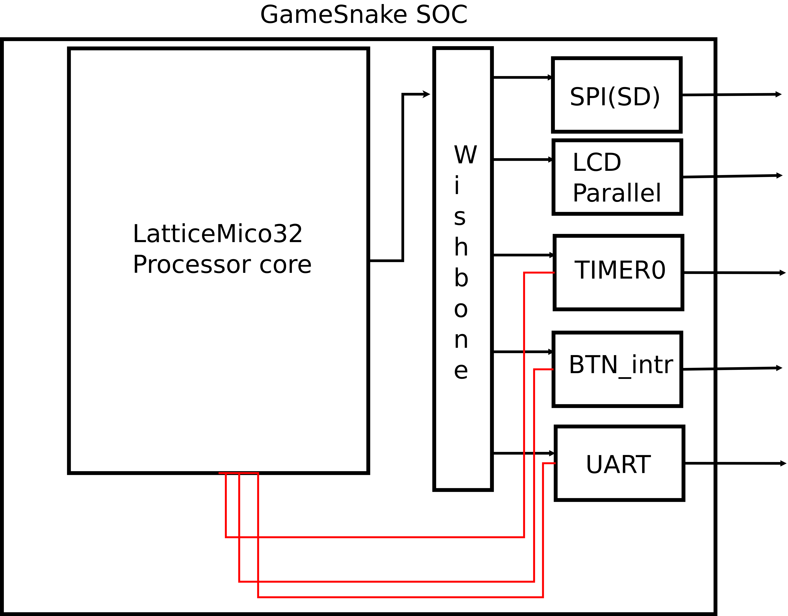

# GameSnake
Classic snake game

### Contributors
Luis Carlos Díaz Fajardo
Sebastian Camilo Cortés Salazar

#### El proyecto
El GameSnake es una consola de un videojuego pensada como proyecto final de la asignatura Electrónica Digital II. Con un diseño gráfico basado en la consola Nintengo GameBoy,el proyecto consta de un prototipo de consola en el que puede jugar el famoso videojuego del celular Nokia 1100 Snake. Los datos gráficos del videojuego que se denominarán Tiles son leídos directamente desde una tarjeta SD de 2Gb conectada al dispositivo. El entorno gráfico escogido para el videojuego fue un fondo de color verde y obstáculos, entorno de puntaje y la serpiente de colores a base de escalas de grises. Cuenta con cinco botones; cuatro de estos son las direcciones del Snake y el último es para pausar el videojuego o para reiniciarlo en caso de pérdida.

A nivel técnico el proyecto se compone de una implementación de System On Chip (SoC) con el procesador SoftCore LatticeMicco32 (LM32) y los correspondientes periféricos, la comunicación entre el procesador y los periféricos es mediante la implementación del bus Wishbone.

La pantalla de visualización es el chip ILI9341 el cual se comunica en paralelo con el maestro. Para controlar la pantalla se diseñó desde hardware el periférico correspondiente. Para la lectura de los datos de la tarjeta SD se realiza la comunicación mediate protocolo SPI. Los botones del videojuego se manejan mendiante entradas de propósito general (GPI)    

