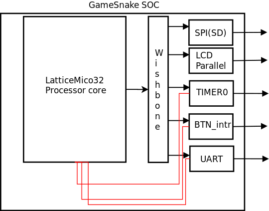
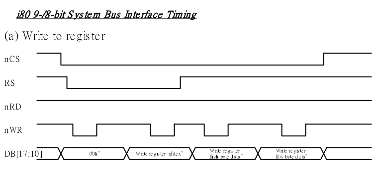
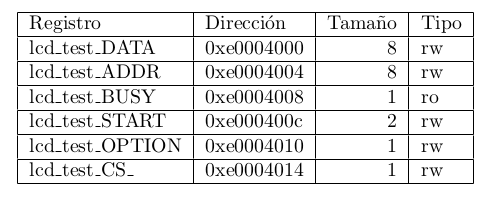
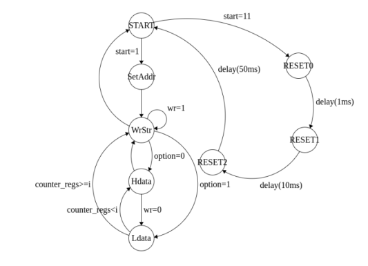
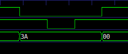
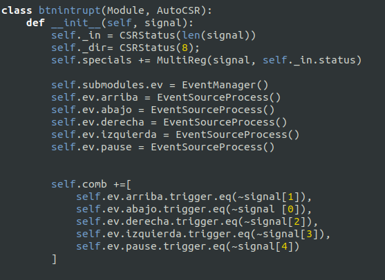
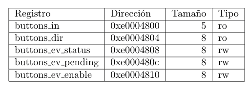
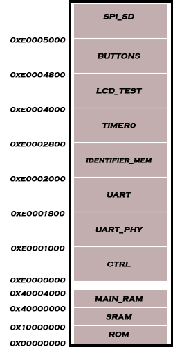

:+1: Inicio a construir la plataforma entre SD Software y Hardware :shipit:

This site was built using [enjoy-digital pages](https://github.com/enjoy-digital/fpga_101/).

This site was built using [GameGirl Pages](https://github.com/luisajojoa/GameGirl).

This site was built using [elm-chan pages](http://elm-chan.org/docs/mmc/mmc_e.html).

# GameSnake
Classic snake game

## Contributors

- Luis Carlos Díaz Fajardo

@lcdiazf :+1: This is my emoji :shipit:

- Sebastian Camilo Cortés Salazar

@sccortessa :+1: This is my emoji ::v:

## El proyecto
El GameSnake es una consola de un videojuego pensada como proyecto final de la asignatura Electrónica Digital II. Con un diseño gráfico basado en la consola Nintengo GameGirl, el proyecto consta de un prototipo de consola en el que puede jugar el famoso videojuego del celular Nokia 1100 Snake. Los datos gráficos del videojuego que se denominarán Tiles son leídos directamente desde una tarjeta SD de 2Gb conectada al dispositivo. El entorno gráfico escogido para el videojuego fue un fondo de color verde y obstáculos, entorno de puntaje y la serpiente de colores a base de escalas de grises. Cuenta con cinco botones; cuatro de estos son las direcciones del Snake y el último es para pausar el videojuego o para reiniciarlo en caso de pérdida.

## LatticeMicroController 32

### LM32

A nivel técnico el proyecto se compone de una implementación de System On Chip (SoC) con el procesador SoftCore LatticeMicco32 (LM32) y los correspondientes periféricos, la comunicación entre el procesador y los periféricos es mediante la implementación del bus Wishbone.

La pantalla de visualización es el chip ILI9341 el cual se comunica en paralelo con el maestro. Para controlar la pantalla se diseñó desde hardware el periférico correspondiente. Para la lectura de los datos de la tarjeta SD se realiza la comunicación mediate protocolo SPI. Los botones del videojuego se manejan mendiante entradas de propósito general (GPI) pero a través de interrupciones. Finalmente para la comunicación de la tarjeta se implementa el perifperico UART. 

### Especificaciones
GameSnake cuenta con las siguientes especificaciones 

* Pantalla a color RGB LCD de resolución 240x320. Se utilizaron solamente 4 colores diferentes y la resolución final del videojugego fue de 240x240.
* Lector de tarjeta SD de 2GB. Los datos gráficos del videojuego están almacenados en la tarjeta y mediante el lector son graficadas en tiempo real en la pantalla.
* 5 pulsadores de movimiento de la serpiente y de pausa/reinicio. Las ejecuciones de los botones se realizan mediante interrupciones del procesador.
* Procesador de 32 bits (LM32).
* Frecuencia del reloj: 32MHz.
* Memoria ROM integrada de 8Kbits.
* Memoria RAM de 8KB.

## Hardware

### LCD Paralelo

El perifrico diseñado enteramente en este proyecto fue un controlador del chip de la pantalla ILI9341. Para realizar este diseño se tuvieron en cuenta dos cosas

* Registros de control y datos de comandos del chip ILI9341.
* Diagrama de tiempos del chip.

Con lo anterior se deja una base para realizar el diseño con descripción de hardware del controlador del chip.

La shield del chip tiene los siguientes pines:
* DB[7:0]
* RS
* WR
* RST
* CS
* RD

Como se trata de un solo esclavo (la pantalla LCD) que manejará el periférico, el pin CS se deja permanentemente en nivel bajo; de la misma manera el periférico solo escribirá datos en el esclavo, mas no leerá registros de este, por lo que también el pin RD (que habilita lectura/escritura de los registros del chip) se dejará constantemente en nivel bajo.

Aclarado lo anterior, se muestra como sigue el diagrama de tiempos que debe tener el periférico en su salida para la correcta escritura de datos en los registros del chip

Tener en cuenta los tiempos mínimos y máximos establecidos en la hoja de datos del chip ILI9341.

El periférico diseñado realiza la tarea descrita en el diagrama de tiempos; hace dos tareas diferenciadas:
* Escribir un dato en la salida a modo de instrucción (seleccionar una dirección de registro, RS nivel bajo).
* escribir un dato en la salida a modo de argumento (guardar un dato en el registro seleccionado, RS nivel alto).

El módulo está diseñado con la herramienta LiteX mediante el uso del submódulo FSM (ver documentación de creación de máquinas de estado finitas en litex).

El mapa de memoria se relaciona a continuación.

Las señales de control START y BUSY respectivamente da inicio al ciclo de escritura y asegura que no se realice un ciclo mientras se est realizando otro en ese momento. Para efectos de generalidad, se deja como registro el valor que se escribe en el pin CS, para casos en los que se necesite manejar más de una pantalla. Queda pendiente realizar la generalidad para el caso en que se necesite leer datos de los registros del chip.

## Buttons

### Botones

Se realiza un módulo en el que se implementan los botones como entradas con interrupciones.

EventManager() es el administrador de eventos dado por LiteX. Con este módulo se manejan las interrupciones.
Se configura la interrupción para ser activada mediante flanco negativo; pero se conecta directamente a los disparadores las señales negadas puesto que los botones son normalmente abiertos.

El mapa de memoria general del SoC es el siguiente

## Software

En esta sección se describe el funcionamiento del firmware que controla los periféricos en hardware:

* Software périfericos
* Firmware snake

### Software périfericos

## Firmware

### Firmware Snake

Adelante se descirbe la lógica que controla el juego, además aqeulla que controla la interfaz de usuario y finalmente se describe la función que ubica a la Snake en su posición inicial.

* Control (Control unit)
* UI (User interface)
* Idle (Initial state)

### Control

### User interface

### Idle State
